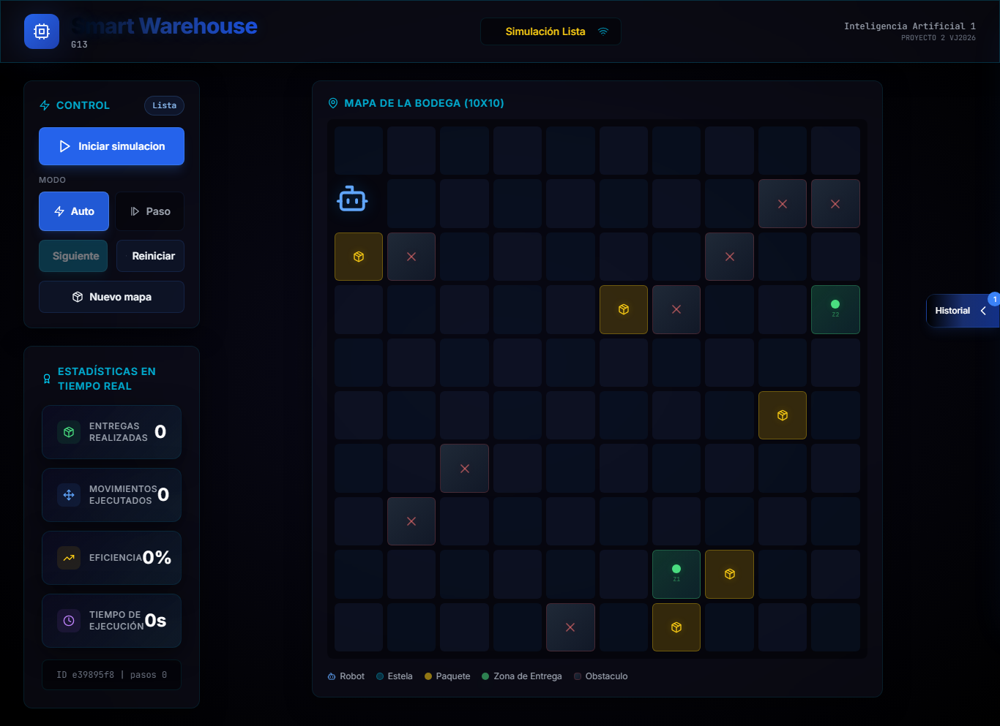
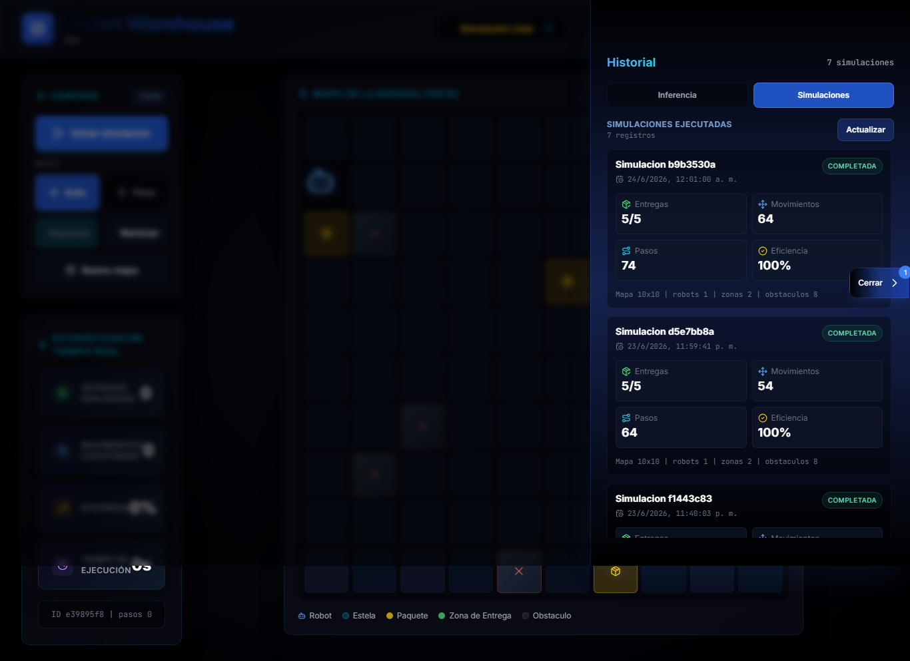
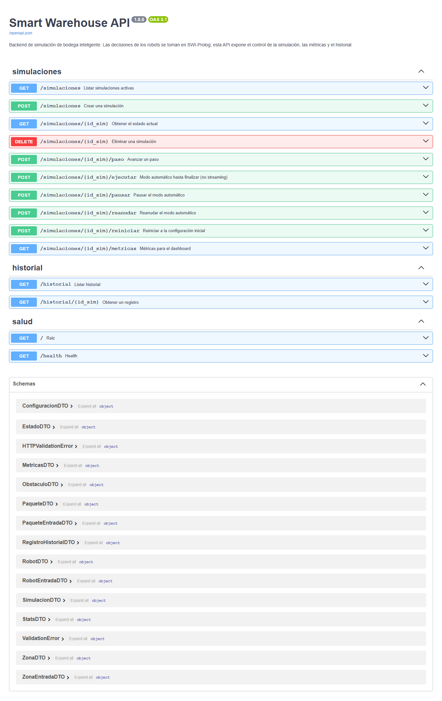

# Evidencias de Funcionamiento

Las siguientes capturas fueron tomadas con el sistema ejecutandose mediante Docker Compose.

## 1. Dashboard Principal

Muestra el panel de control, mapa 10x10, robot, paquetes, zonas de entrega, obstaculos y estadisticas.



## 2. Historial de Simulaciones

Muestra la vista visual del historial de simulaciones finalizadas, con entregas, movimientos, pasos y eficiencia.



## 3. Documentacion Swagger de la API

Muestra la API FastAPI disponible en `/docs`.



## 4. Prueba de Integracion

Se ejecuto la prueba de integracion dentro del contenedor backend:

```powershell
docker exec smart_warehouse_api sh -lc "cd /app && PROLOG_FILE=/app/prolog/warehouse.pl python pruebas_fase2.py"
```

Resultado:

```text
Creada simulacion ... | estado=creada
Tras 3 pasos -> pasos=3, movimientos=3
Final -> estado=finalizada, entregas=2/2, pasos=40, tasa=1.00
Registros en historial: 1 -> completada
Tras reinicio -> entregas=0, pasos=0
Fase 2 validada: ciclo completo, historial y reinicio OK.
```

