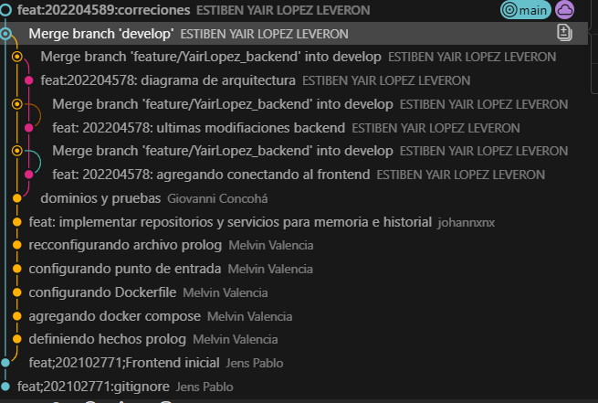
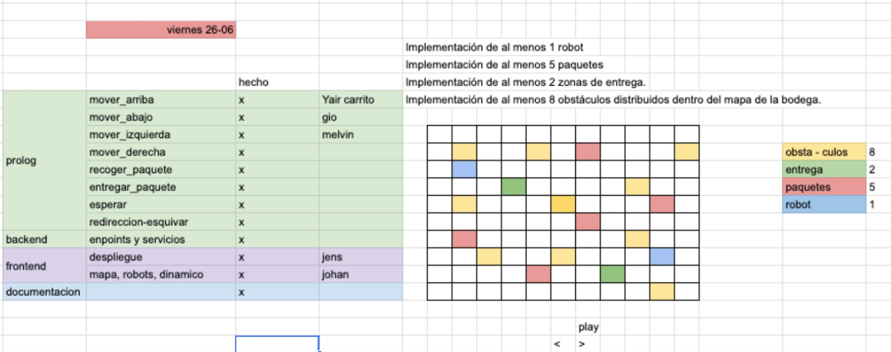

# Evidencias de Funcionamiento

Las siguientes capturas fueron tomadas con el sistema ejecutandose mediante Docker Compose.

## 1. Dashboard Principal

Muestra el panel de control, mapa 10x10, robot, paquetes, zonas de entrega, obstaculos y estadisticas.

## 2. Historial de Simulaciones

Muestra la vista visual del historial de simulaciones finalizadas, con entregas, movimientos, pasos y eficiencia.

## 3. Documentacion Swagger de la API

Muestra la API FastAPI disponible en `/docs`.

## 4. Prueba de git 

prueba de excel reparticion de funciones
