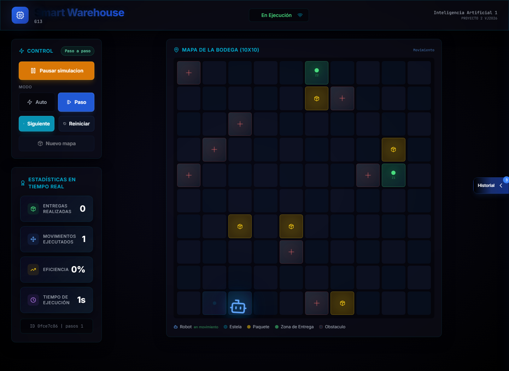

# Manual de Usuario - Smart Warehouse

## 1. Descripcion General

Smart Warehouse es una aplicacion web que simula una bodega inteligente. En la simulacion existe un robot que debe recoger paquetes y llevarlos hacia sus zonas de entrega correspondientes, evitando obstaculos dentro de un mapa de 10x10 casillas.

La aplicacion permite observar el comportamiento del robot en tiempo real, controlar la ejecucion de la simulacion, cambiar entre modo automatico y modo paso a paso, consultar estadisticas y revisar el historial de simulaciones finalizadas.

El usuario interactua con el frontend web. Internamente, el frontend se comunica con una API en Python, y la API consulta reglas en Prolog para decidir el movimiento del robot.

## 2. Requisitos

- Docker Desktop instalado.
- Navegador moderno: Chrome, Edge o Firefox.
- Puerto `3000` disponible para el frontend.
- Puerto `8000` disponible para el backend.

## 3. Instalacion y Ejecucion

Desde la raiz del proyecto ejecutar:

```powershell
docker compose up -d --build
```

Verificar que los contenedores esten activos:

```powershell
docker compose ps
```

Abrir la aplicacion en el navegador:

```text
http://localhost:3000
```

Abrir la documentacion de la API:

```text
http://localhost:8000/docs
```

Detener el sistema:

```powershell
docker compose down
```

## 4. Como Funciona la Aplicacion

La aplicacion trabaja con una simulacion activa. Al iniciar, se crea un mapa de bodega con:

- Un robot.
- Cinco paquetes.
- Dos zonas de entrega.
- Ocho obstaculos.
- Casillas libres por donde el robot puede desplazarse.

El objetivo del robot es entregar todos los paquetes. Para lograrlo, la aplicacion ejecuta ciclos de simulacion. En cada ciclo ocurre lo siguiente:

1. El frontend solicita avanzar la simulacion.
2. El backend revisa el estado actual del mapa.
3. El backend envia los hechos actuales a Prolog.
4. Prolog decide la siguiente accion del robot.
5. El backend aplica la accion.
6. El frontend actualiza el tablero, estadisticas e historial de inferencia.

Las acciones posibles del robot incluyen moverse por el mapa, recoger un paquete y entregarlo en una zona valida. Si hay obstaculos cerca, el robot calcula una ruta alternativa para evitar quedarse bloqueado.

Captura general del sistema en ejecucion:


## 5. Pantalla Principal

La pantalla principal esta organizada en tres areas:

- Panel de control: permite iniciar, pausar, reanudar, reiniciar y cambiar el modo de ejecucion.
- Tablero de la bodega: muestra el mapa 10x10 con el robot, paquetes, zonas y obstaculos.
- Panel lateral: muestra el historial de inferencia y el historial visual de simulaciones.

Tambien se muestran estadisticas en tiempo real para conocer el avance de la simulacion.

En esta vista se observa el panel de control a la izquierda, el tablero al centro y el acceso al historial en el lateral derecho.

## 6. Tablero de la Bodega

El tablero representa la bodega usando una cuadricula de 10 filas por 10 columnas. Cada casilla puede estar libre u ocupada por un elemento.

Elementos visuales:

- Robot: representa la posicion actual del agente.
- Paquete: objeto que debe ser recogido y entregado.
- Zona de entrega: destino valido para paquetes.
- Obstaculo: casilla bloqueada que el robot no puede atravesar.
- Ruta o estela: indica el recorrido reciente del robot.

El robot se mueve de una casilla a otra. No puede salir del mapa ni atravesar obstaculos. Cuando llega a una casilla con paquete, puede recogerlo. Luego busca una zona de entrega valida y se dirige hacia ella.

Ejemplo del tablero durante una simulacion paso a paso:



## 7. Panel de Control

### Iniciar Simulacion

Comienza la ejecucion de la simulacion actual. Si el modo automatico esta activo, el robot empezara a avanzar por si mismo. Si el modo paso a paso esta activo, la simulacion queda lista para avanzar usando el boton `Siguiente`.

### Pausar Simulacion

Detiene temporalmente la simulacion. Se puede usar cuando el robot esta avanzando automaticamente o cuando se desea observar el estado actual con mas calma.

### Reanudar Simulacion

Continua una simulacion que fue pausada. Al presionarlo, la aplicacion sigue desde el mismo punto donde se detuvo, sin reiniciar el mapa ni perder el progreso.

### Reiniciar

Restaura la simulacion actual a su estado inicial. El robot, paquetes, zonas y obstaculos vuelven a la configuracion original de esa simulacion.

### Nuevo Mapa

Crea una nueva configuracion de bodega. Esto cambia la posicion inicial del robot, paquetes, zonas y obstaculos. Es util para probar diferentes escenarios.

### Modo Automatico

En este modo el robot avanza continuamente. La aplicacion ejecuta pasos de simulacion de forma automatica hasta que se pause, se reinicie o finalice la entrega de paquetes.

### Modo Paso a Paso

En este modo el usuario controla cada avance. El robot solo ejecuta un movimiento o accion cuando se presiona el boton `Siguiente`.

Este modo es util para observar con detalle las decisiones del robot, especialmente cuando hay obstaculos o cuando el camino hacia el paquete no es directo.

### Siguiente

Ejecuta un unico paso de simulacion. El boton esta disponible en modo paso a paso y permite avanzar sin tener que reiniciar la simulacion.

En la captura anterior se puede ver el modo `Paso` activo, el boton `Siguiente` disponible y la simulacion en ejecucion. Esto permite analizar el recorrido del robot movimiento por movimiento.

## 8. Estadisticas

El panel de estadisticas resume el estado de la simulacion:

- Entregas realizadas: cantidad de paquetes entregados correctamente.
- Movimientos ejecutados: cantidad de desplazamientos realizados por el robot.
- Pasos: ciclos de simulacion ejecutados.
- Eficiencia: relacion entre entregas y movimientos.
- Tiempo de ejecucion: duracion aproximada de la simulacion.
- ID de simulacion: identificador usado por la API para consultar o reiniciar el estado.

Estas estadisticas ayudan a comparar simulaciones y revisar si el robot esta completando entregas de forma eficiente.

## 9. Historial e Inferencia

El panel lateral permite consultar dos vistas.

### Inferencia

Muestra los eventos generados durante la simulacion actual. Aqui se pueden observar acciones como movimientos, recoleccion de paquetes, entregas y decisiones tomadas durante el avance.

Esta vista sirve para comprender que esta haciendo el robot en cada paso.

### Simulaciones

Muestra un historial visual de simulaciones finalizadas. Cada registro contiene informacion como:

- ID de la simulacion.
- Fecha de finalizacion.
- Cantidad de entregas.
- Movimientos realizados.
- Pasos ejecutados.
- Eficiencia.
- Datos generales del mapa.

Esta vista permite comparar ejecuciones anteriores sin tener que revisar la base de datos manualmente.

Ejemplo de la vista de historial de simulaciones:


## 10. Flujo Recomendado de Uso

1. Abrir `http://localhost:3000`.
2. Revisar el tablero inicial.
3. Seleccionar `Auto` o `Paso`.
4. Presionar `Iniciar simulacion`.
5. Observar como el robot busca paquetes y evita obstaculos.
6. Usar `Pausar simulacion` si se desea detener temporalmente.
7. Usar `Reanudar simulacion` para continuar.
8. Cambiar a modo `Paso` si se desea analizar cada accion.
9. Al finalizar, abrir el panel lateral y revisar `Simulaciones`.
10. Usar `Nuevo mapa` para probar otro escenario.

## 11. Finalizacion de una Simulacion

Una simulacion finaliza cuando el robot entrega todos los paquetes posibles. Al finalizar:

- El estado cambia a finalizado.
- Las estadisticas quedan con los valores finales.
- El backend guarda un registro en el historial.
- La vista `Simulaciones` permite consultar el resultado.

Si se desea volver a ejecutar el mismo escenario, se puede usar `Reiniciar`. Si se desea otro escenario, se puede usar `Nuevo mapa`.

## 12. Problemas Comunes

### El frontend no abre

Verificar que los contenedores esten activos:

```powershell
docker compose ps
```

Luego abrir:

```text
http://localhost:3000
```

### La API no responde

Verificar el endpoint de salud:

```powershell
Invoke-RestMethod http://localhost:8000/health
```

Tambien se puede abrir:

```text
http://localhost:8000/docs
```

Vista de la documentacion interactiva de la API:


### Los puertos estan ocupados

Si los puertos `3000` o `8000` estan siendo usados por otro programa, se deben detener esos servicios o cambiar los puertos en `docker-compose.yaml`.

### El robot no se mueve

Revisar lo siguiente:

- Que la simulacion haya sido iniciada.
- Que no este pausada.
- Que en modo paso a paso se este presionando `Siguiente`.
- Que el backend este activo.

### No aparece historial de simulaciones

El historial se llena cuando una simulacion finaliza. Si no hay simulaciones terminadas, la pestana `Simulaciones` puede aparecer vacia.
